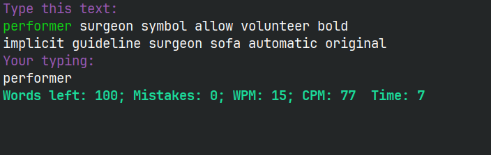
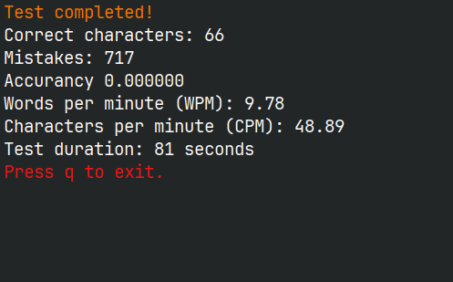

# Speed-Typing-Test
This is a simple speed typing test program implemented in C using the ncurses library. The program allows users to test their typing speed by entering a given text as fast and accurately as possible.

## Features

- Randomly generates text for typing practice.
- Calculates typing speed in words per minute (WPM), character per minute and accuracy.
- User-friendly interface using ncurses for terminal-based interaction.

## Requirements

- C Compiler (GCC)
- ncurses library

## How to Build and Run

1. Clone the repository
`git clone https://github.com/Bullet4Men/Speed-Typing-Test`

1. 1. If you use NixOS then do this
`nix-shell`

2. Navigate to the project directory
`cd Speed-Typing-Test`

3. Compile the program
`mkdir build && make`

4. Run the program
`./build/speed_typing_test`

## Screenshots

## License
This project is licensed under the GPL3 License

